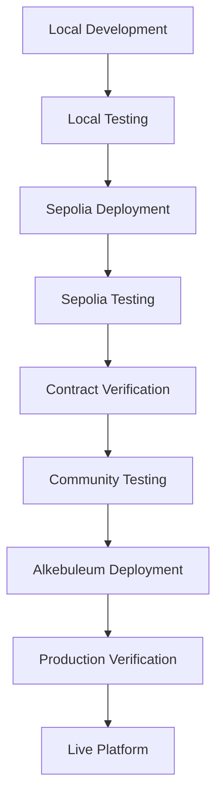

# 🚀 Welcome Home Property - Deployment Instructions

Complete deployment guide for the Welcome Home Property platform from development to production on Sepolia testnet and Alkebuleum mainnet.

## 📚 **Table of Contents**

1. [Prerequisites](#prerequisites)
2. [Environment Setup](#environment-setup)
3. [Local Development](#local-development)
4. [Sepolia Testing](#sepolia-testing)
5. [Alkebuleum Production](#alkebuleum-production)
6. [Contract Verification](#contract-verification)
7. [Testing & Quality Assurance](#testing--quality-assurance)
8. [Troubleshooting](#troubleshooting)
9. [Security Checklist](#security-checklist)

## 🔧 **Prerequisites**

### Required Software
- **Node.js**: Version 16+ 
- **npm**: Version 8+
- **Git**: Latest version
- **MetaMask**: Web3 wallet extension

### Required Accounts & API Keys
- **Ethereum Sepolia Testnet**: 
  - RPC URL (Infura, Alchemy, or custom)
  - Private key for deployment
  - Etherscan API key for verification
- **Alkebuleum Mainnet**:
  - RPC URL
  - Private key for deployment
  - Explorer API key (if available)

### Required Funds
- **Sepolia**: Test ETH (free from faucets)
- **Alkebuleum**: Real ALKE tokens for gas fees

## ⚙️ **Environment Setup**

### 1. Clone Repository
```bash
git clone <repository-url>
cd welcomehome
npm install
```

### 2. Environment Configuration
```bash
# Copy environment template
cp env.example .env

# Edit .env with your configuration
nano .env
```

### 3. Required Environment Variables
```env
# Network Configuration
SEPOLIA_RPC_URL=https://sepolia.infura.io/v3/YOUR_PROJECT_ID
SEPOLIA_CHAIN_ID=11155111

# Alkebuleum Mainnet (Production)
ALKEBULEUM_RPC_URL=https://rpc.alkebuleum.org
ALKEBULEUM_CHAIN_ID=1337
ALKEBULEUM_GAS_PRICE=1000000000

# Alkebuleum Testnet (if available)
ALKEBULEUM_TESTNET_RPC_URL=https://testnet-rpc.alkebuleum.org
ALKEBULEUM_TESTNET_CHAIN_ID=1338
ALKEBULEUM_TESTNET_GAS_PRICE=1000000000

# API Keys
ETHERSCAN_API_KEY=your-etherscan-api-key
ALKEBULEUM_EXPLORER_API_KEY=your-alkebuleum-explorer-api-key

# Explorer URLs
ALKEBULEUM_EXPLORER_URL=https://explorer.alkebuleum.org
ALKEBULEUM_EXPLORER_API_URL=https://explorer.alkebuleum.org/api
ALKEBULEUM_TESTNET_EXPLORER_URL=https://testnet-explorer.alkebuleum.org
ALKEBULEUM_TESTNET_EXPLORER_API_URL=https://testnet-explorer.alkebuleum.org/api

# Deployment Configuration
PRIVATE_KEY=your-private-key-here
DEPLOYER_ADDRESS=your-deployer-address-here

# Gas Reporting
REPORT_GAS=true
GAS_PRICE=1

# Contract Verification
VERIFY_CONTRACTS=true
```

## 🏠 **Local Development**

### 1. Start Local Blockchain
```bash
# Start Hardhat local network
npm run node
```

### 2. Deploy Contracts Locally
```bash
# In a new terminal
npm run deploy:local
```

### 3. Run Local Tests
```bash
# Run all tests
npm run test

# Run tests with gas reporting
npm run test:gas

# Run specific test file
npx hardhat test test/WelcomeHomeProperty.test.js
```

### 4. Local Development Commands
```bash
# Compile contracts
npm run compile

# Check contract sizes
npm run size

# Generate coverage report
npm run coverage

# Lint contracts
npm run lint
npm run lint:fix
```

## 🧪 **Sepolia Testing**

### 1. Prepare Sepolia Network
```bash
# Ensure you have test ETH
# Visit: https://sepoliafaucet.com/
# Or use: https://faucet.sepolia.dev/
```

### 2. Deploy to Sepolia
```bash
# Deploy all contracts
npm run deploy:sepolia

# Verify deployment
node scripts/verify-deployment.js
```

### 3. Test on Sepolia
```bash
# Run comprehensive tests
npm run test

# Test with gas reporting
REPORT_GAS=true npm run test

# Test specific functionality
npx hardhat test --network sepolia
```

### 4. Sepolia Verification
```bash
# Verify contracts on Etherscan
npm run verify:sepolia

# Manual verification if needed
npx hardhat verify --network sepolia <CONTRACT_ADDRESS> <CONSTRUCTOR_ARGS>
```

### 5. Sepolia Testing Checklist
- [ ] All contracts deployed successfully
- [ ] KYC registry working
- [ ] Property creation functional
- [ ] Marketplace operations working
- [ ] Governance system operational
- [ ] All roles and permissions set correctly
- [ ] Gas costs acceptable
- [ ] No critical errors in logs

## 🚀 **Alkebuleum Production**

### 1. Pre-Production Checklist
- [ ] All Sepolia tests passed
- [ ] Contracts verified on Sepolia
- [ ] Gas optimization completed
- [ ] Security audit passed (if applicable)
- [ ] Team approval received
- [ ] Backup deployment plan ready

### 2. Deploy to Alkebuleum
```bash
# Deploy to Alkebuleum mainnet
npm run deploy:alkebuleum

# Verify deployment
node scripts/verify-deployment.js
```

### 3. Production Verification
```bash
# Verify contracts on Alkebuleum explorer
npm run verify:alkebuleum

# Manual verification if needed
npx hardhat verify --network alkebuleum <CONTRACT_ADDRESS> <CONSTRUCTOR_ARGS>
```

### 4. Post-Deployment Setup
```bash
# Grant additional roles if needed
# Set up monitoring and alerts
# Configure backup admin accounts
# Test emergency functions
```

## 🔍 **Contract Verification**

### Sepolia Verification
```bash
# Automatic verification
npm run verify:sepolia

# Manual verification
npx hardhat verify --network sepolia \
  --contract contracts/KYCRegistry.sol:KYCRegistry \
  <CONTRACT_ADDRESS>
```

### Alkebuleum Verification
```bash
# Automatic verification
npm run verify:alkebuleum

# Manual verification
npx hardhat verify --network alkebuleum \
  --contract contracts/AlkebuleumPropertyToken.sol:AlkebuleumPropertyToken \
  <CONTRACT_ADDRESS> \
  "WelcomeHomeProperty" "WH" 1000000000000000000000000 <KYC_REGISTRY_ADDRESS> <ADMIN_ADDRESS>
```

## 🧪 **Testing & Quality Assurance**

### 1. Test Categories
```bash
# Unit Tests
npm run test

# Gas Tests
npm run test:gas

# Integration Tests
npx hardhat test test/integration/

# Security Tests
npx hardhat test test/security/
```

### 2. Test Networks
- **Local**: `npm run deploy:local`
- **Sepolia**: `npm run deploy:sepolia`
- **Alkebuleum Testnet**: `npm run deploy:alkebuleum-testnet`

### 3. Quality Checks
```bash
# Contract size analysis
npm run size

# Code coverage
npm run coverage

# Linting
npm run lint

# Security analysis
npm run security:check
```

## 🚨 **Troubleshooting**

### Common Issues

#### 1. Deployment Failures
```bash
# Check network connectivity
npx hardhat console --network sepolia

# Verify account balance
npx hardhat balance --account <ADDRESS> --network sepolia

# Check gas prices
npx hardhat gas-price --network sepolia
```

#### 2. Contract Verification Issues
```bash
# Verify constructor arguments
npx hardhat verify --network sepolia <ADDRESS>

# Check contract bytecode
npx hardhat verify --network sepolia <ADDRESS> --show-stack-traces
```

#### 3. Gas Issues
```bash
# Optimize contracts
npm run compile

# Check gas usage
npm run test:gas

# Analyze gas costs
npx hardhat test --gas-report
```

### Error Resolution

#### "Insufficient funds"
- Get test ETH from Sepolia faucet
- Check account balance
- Verify gas price settings

#### "Contract verification failed"
- Verify constructor arguments
- Check network configuration
- Ensure contract is deployed

#### "Role access denied"
- Check role assignments
- Verify deployer permissions
- Review role hierarchy

## 🔒 **Security Checklist**

### Pre-Deployment Security
- [ ] All tests passing
- [ ] No critical vulnerabilities
- [ ] Access control verified
- [ ] Emergency functions tested
- [ ] Role hierarchy reviewed
- [ ] Gas limits appropriate

### Post-Deployment Security
- [ ] Admin keys secured
- [ ] Multi-sig setup (if applicable)
- [ ] Monitoring configured
- [ ] Backup procedures documented
- [ ] Incident response plan ready

### Ongoing Security
- [ ] Regular security audits
- [ ] Access review cycles
- [ ] Emergency contact list updated
- [ ] Security patches applied
- [ ] Community monitoring active

## 📊 **Monitoring & Maintenance**

### 1. Contract Monitoring
```bash
# Check contract status
npx hardhat console --network alkebuleum

# Monitor events
npx hardhat events --contract <ADDRESS> --network alkebuleum

# Check balances
npx hardhat balance --account <ADDRESS> --network alkebuleum
```

### 2. Performance Metrics
- Gas usage trends
- Transaction success rates
- User activity patterns
- Contract interaction frequency

### 3. Maintenance Tasks
- Regular role reviews
- Gas price updates
- Contract upgrades (if needed)
- Security patches

## 🔄 **Deployment Workflow Summary**



## 📞 **Support & Resources**

### Documentation
- [OpenZeppelin Contracts](https://docs.openzeppelin.com/contracts/)
- [Hardhat Documentation](https://hardhat.org/docs/)
- [Ethereum Development](https://ethereum.org/developers/)
- [Alkebuleum Blockchain](https://alkebuleum.org/)

### 📖 **Platform Documentation**
- **[User Flow Documentation](USER_FLOW_DOCUMENTATION.md)** - Complete user journey and system flows
- **[Security Token List](SECURITY_TOKEN_LIST.md)** - Security mechanisms and access control
- **[Database Schema](DATABASE_SCHEMA.md)** - Complete database structure and relationships
- **[Backend API Documentation](backend/README.md)** - Backend API endpoints and usage

### Community Support
- GitHub Issues
- Development Team
- Community Forums
- Technical Documentation

### Emergency Contacts
- **Technical Lead**: [Contact Info]
- **Security Team**: [Contact Info]
- **Operations**: [Contact Info]

---

**Last Updated**: [Current Date]
**Version**: 1.0
**Maintained By**: Welcome Home Property Development Team
