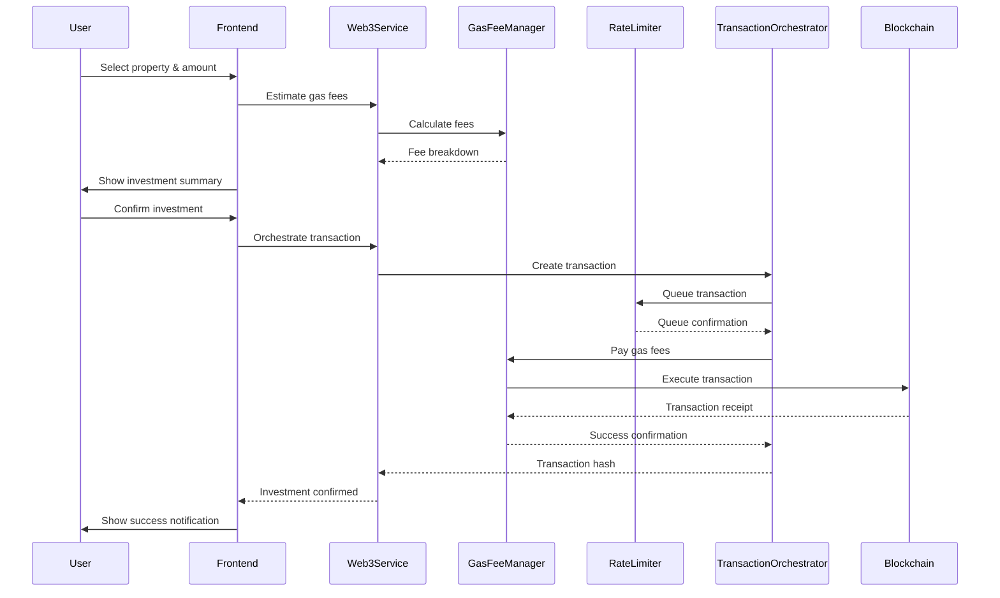
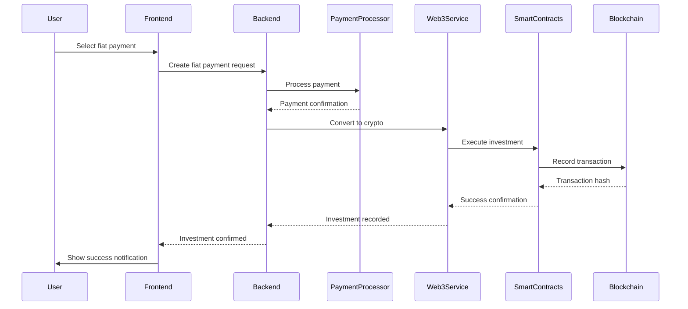

# Property Investment Platform - Frontend Integration Guide

## Overview

This document explains how the newly created frontend integrates with the existing smart contracts (`GasFeeManager`, `RateLimiter`, and `TransactionOrchestrator`) to create a complete Property Investment Platform that supports both fiat and crypto payments.

## 🏗️ System Architecture

### Complete Stack
```
┌─────────────────────────────────────────────────────────────┐
│                    Frontend (React + TypeScript)            │
├─────────────────────────────────────────────────────────────┤
│  • User Interface Components                                │
│  • Wallet Integration (MetaMask, WalletConnect)            │
│  • Property Marketplace                                     │
│  • Investment Management                                    │
│  • Real-time Notifications                                  │
├─────────────────────────────────────────────────────────────┤
│                    Backend API (Node.js)                   │
├─────────────────────────────────────────────────────────────┤
│  • User Authentication & KYC                                │
│  • Property Management                                      │
│  • Fiat Payment Processing                                  │
│  • Database Operations                                      │
├─────────────────────────────────────────────────────────────┤
│                Smart Contracts (Solidity)                   │
│  ┌─────────────────┬─────────────────┬─────────────────┐   │
│  │ GasFeeManager   │ RateLimiter     │ Transaction     │   │
│  │                 │                 │ Orchestrator    │   │
│  └─────────────────┴─────────────────┴─────────────────┘   │
├─────────────────────────────────────────────────────────────┤
│                Blockchain Networks                          │
│  • Ethereum Mainnet                                        │
│  • Polygon                                                 │
│  • Alkebuleum (Local)                                      │
│  • Sepolia Testnet                                         │
└─────────────────────────────────────────────────────────────┘
```

## 🔗 Smart Contract Integration

### 1. GasFeeManager Integration

**Purpose**: Manages token deposits, withdrawals, and gas fee payments for transactions.

**Frontend Integration Points**:

#### Web3 Service (`src/services/web3.ts`)
```typescript
// Deposit native tokens (ETH/MATIC/ALK)
async depositNative(amount: string): Promise<boolean>

// Deposit ERC20 tokens
async depositERC20(tokenAddress: string, amount: string): Promise<boolean>

// Request transaction with gas fee management
async requestTransaction(
  target: string,
  value: string,
  data: string,
  gasLimit: string,
  maxFeePerGas: string,
  maxPriorityFeePerGas: string,
  tokenAddress: string,
  tokenAmount: string
): Promise<string>

// Get user balance
async getUserBalance(user: string, tokenAddress: string): Promise<string>
```

#### Investment Modal (`src/components/investment/InvestmentModal.tsx`)
- **Gas Fee Estimation**: Automatically calculates gas fees for property investments
- **Transaction Cost Breakdown**: Shows detailed cost breakdown including:
  - Gas cost
  - Platform fee (0.5%)
  - Network fee (1%)
  - Total cost
- **Priority Selection**: Users can choose transaction priority levels

### 2. RateLimiter Integration

**Purpose**: Manages transaction rate limiting and throughput control for efficient local node operation.

**Frontend Integration Points**:

#### Web3 Service
```typescript
// Queue transaction with priority
async queueTransaction(
  target: string,
  gasLimit: string,
  priority: Priority,
  priorityFee: string
): Promise<string>

// Execute next transaction
async executeNextTransaction(maxGas: string): Promise<string>

// Get queue statistics
async getQueueStats(): Promise<TransactionQueueStats>

// Get user rate limits
async getUserRate(user: string): Promise<UserRate>
```

#### Dashboard (`src/pages/Dashboard.tsx`)
- **Queue Status Display**: Shows real-time transaction queue statistics
- **Performance Metrics**: Displays success rates and execution times
- **User Rate Monitoring**: Tracks user transaction limits

### 3. TransactionOrchestrator Integration

**Purpose**: Unified interface that combines GasFeeManager and RateLimiter functionality.

**Frontend Integration Points**:

#### Web3 Service
```typescript
// Orchestrate complete transaction
async orchestrateTransaction(
  target: string,
  value: string,
  data: string,
  gasLimit: string,
  maxFeePerGas: string,
  maxPriorityFeePerGas: string,
  tokenAddress: string,
  tokenAmount: string,
  priority: Priority
): Promise<string>

// Execute specific transaction
async executeTransaction(transactionId: string): Promise<void>

// Execute batch of transactions
async executeBatch(transactionIds: string[]): Promise<void>

// Get performance metrics
async getPerformanceMetrics(): Promise<PerformanceMetrics>
```

#### Dashboard Performance Monitoring
- **System Performance**: Real-time metrics from TransactionOrchestrator
- **Transaction Processing**: Total processed, gas used, success rates
- **Throughput Monitoring**: Transactions per second, gas per second

## 💰 Payment Flow Integration

### Crypto Payment Flow



### Fiat Payment Flow



## 🎯 Key Features Integration

### 1. Multi-Network Support

**Supported Networks**:
- **Ethereum Mainnet** (Chain ID: 1)
- **Polygon** (Chain ID: 137)
- **Alkebuleum** (Chain ID: 1337) - Local node
- **Sepolia Testnet** (Chain ID: 11155111)

**Frontend Implementation**:
```typescript
// Network switching in WalletConnection component
const switchNetwork = async (chainId: number) => {
  await web3Service.switchNetwork(chainId);
  // Automatically reinitialize contracts for new network
};
```

### 2. Priority-Based Transaction Processing

**Priority Levels**:
- **LOW** (80% of base fee) - Standard transactions
- **NORMAL** (100% of base fee) - Regular priority
- **HIGH** (120% of base fee) - High priority
- **URGENT** (150% of base fee) - Urgent transactions
- **CRITICAL** (200% of base fee) - Critical system transactions

**Frontend Implementation**:
```typescript
// Priority selection in InvestmentModal
const [priority, setPriority] = useState<Priority>(Priority.NORMAL);

// Priority multiplier calculation
const getPriorityMultiplier = (priority: Priority): number => {
  switch (priority) {
    case Priority.LOW: return 80;
    case Priority.NORMAL: return 100;
    case Priority.HIGH: return 120;
    case Priority.URGENT: return 150;
    case Priority.CRITICAL: return 200;
    default: return 100;
  }
};
```

### 3. Real-Time Performance Monitoring

**Dashboard Metrics**:
- **Transaction Queue Status**: Queued, executed, failed transactions
- **Success Rates**: Overall system performance
- **Execution Times**: Average transaction processing time
- **Gas Usage**: Total gas consumed by the system

**Frontend Implementation**:
```typescript
// Real-time stats loading in Dashboard
const loadSmartContractStats = async () => {
  const stats = await web3Service.getQueueStats();
  const metrics = await web3Service.getPerformanceMetrics();
  setQueueStats(stats);
  setPerformanceMetrics(metrics);
};
```

### 4. Gas Fee Management

**Automatic Gas Fee Calculation**:
- Real-time gas price estimation
- Priority-based fee adjustment
- Platform and network fee calculation
- Total cost breakdown

**Frontend Implementation**:
```typescript
// Gas fee estimation in InvestmentModal
const estimateGasFees = async () => {
  const estimate = await web3Service.estimateGasFees(
    target,
    value,
    data,
    priority
  );
  setGasEstimate(estimate);
};
```

## 🔧 Configuration Requirements

### 1. Smart Contract Addresses

Update contract addresses in `src/services/web3.ts`:
```typescript
const CONTRACT_ADDRESSES = {
  [NETWORKS.ETHEREUM.chainId]: {
    gasFeeManager: '0x...', // Deployed GasFeeManager address
    rateLimiter: '0x...',   // Deployed RateLimiter address
    transactionOrchestrator: '0x...' // Deployed TransactionOrchestrator address
  },
  // Repeat for other networks
};
```

### 2. Environment Variables

Required environment variables:
```env
# API Configuration
REACT_APP_API_URL=http://localhost:3001

# Blockchain Providers
REACT_APP_INFURA_KEY=your_infura_key
REACT_APP_ALCHEMY_KEY=your_alchemy_key

# Payment Processors
REACT_APP_STRIPE_PUBLIC_KEY=your_stripe_key
REACT_APP_MOONPAY_KEY=your_moonpay_key

# Network Configuration
REACT_APP_DEFAULT_NETWORK=1337 # Alkebuleum for local development
```

### 3. Network Configuration

Configure supported networks:
```typescript
export const NETWORKS = {
  ALKEBULEUM: {
    chainId: 1337,
    name: 'Alkebuleum',
    rpcUrl: 'http://localhost:8545', // Local node
    explorer: 'http://localhost:4000',
    nativeCurrency: { name: 'Alkebuleum', symbol: 'ALK', decimals: 18 }
  },
  // Other networks...
};
```

## 🚀 Deployment Steps

### 1. Smart Contract Deployment

1. **Deploy GasFeeManager**:
   ```bash
   npm run deploy:gas-manager:alkebuleum
   ```

2. **Deploy RateLimiter**:
   ```bash
   npm run deploy:rate-limiter:alkebuleum
   ```

3. **Deploy TransactionOrchestrator**:
   ```bash
   npm run deploy:orchestrator:alkebuleum
   ```

### 2. Frontend Configuration

1. **Update contract addresses** in `src/services/web3.ts`
2. **Configure environment variables**
3. **Build and deploy frontend**:
   ```bash
   cd frontend
   npm install
   npm run build
   ```

### 3. Backend Integration

1. **Start backend server**:
   ```bash
   cd backend
   npm install
   npm start
   ```

2. **Configure API endpoints** in frontend environment variables

## 🔒 Security Considerations

### 1. Smart Contract Security
- All contracts use OpenZeppelin's security libraries
- Access control with role-based permissions
- Reentrancy protection on all external calls
- Pausable functionality for emergency situations

### 2. Frontend Security
- Input validation and sanitization
- XSS protection through React's built-in mechanisms
- Secure wallet connection handling
- Error handling and user feedback

### 3. Transaction Security
- User confirmation for all transactions
- Gas limit protection
- Network validation
- Transaction status monitoring

## 📊 Performance Optimization

### 1. Smart Contract Optimization
- Batch processing for multiple transactions
- Efficient gas usage through optimized functions
- Rate limiting to prevent network congestion
- Priority queues for transaction management

### 2. Frontend Optimization
- React Query for efficient data fetching
- Lazy loading of components
- Optimized bundle size
- Caching strategies

### 3. Network Optimization
- Local node operation for faster transactions
- Multi-network support for flexibility
- Automatic network switching
- Connection pooling

## 🧪 Testing Strategy

### 1. Smart Contract Testing
```bash
# Test GasFeeManager
npm run test:gas-manager

# Test RateLimiter
npm run test:rate-limiter

# Test TransactionOrchestrator
npm run test:orchestrator
```

### 2. Frontend Testing
```bash
cd frontend
npm test
npm run test:integration
npm run test:e2e
```

### 3. Integration Testing
- End-to-end payment flows
- Multi-network functionality
- Smart contract integration
- Performance testing

## 🔄 Future Enhancements

### 1. Advanced Features
- **DeFi Integration**: Yield farming and liquidity pools
- **NFT Marketplace**: Property tokenization as NFTs
- **Mobile App**: React Native application
- **Analytics Dashboard**: Advanced investment analytics

### 2. Smart Contract Enhancements
- **Cross-chain Bridges**: Multi-chain property ownership
- **Governance**: DAO for platform decisions
- **Insurance**: Smart contract insurance pools
- **Liquidity**: Automated market makers for property tokens

### 3. Platform Expansion
- **International Markets**: Global property investment
- **Regulatory Compliance**: KYC/AML automation
- **Institutional Features**: Large-scale investment tools
- **API Access**: Third-party integration capabilities

## 📞 Support and Documentation

### 1. Technical Documentation
- [Smart Contract Documentation](GAS_FEE_MANAGER_DOCUMENTATION.md)
- [Rate Limiting Documentation](RATE_LIMITING_AND_ORCHESTRATION_DOCUMENTATION.md)
- [Frontend Documentation](frontend/README.md)

### 2. Development Resources
- [API Reference](docs/api.md)
- [Deployment Guide](docs/deployment.md)
- [Testing Guide](docs/testing.md)

### 3. Community Support
- GitHub Issues for bug reports
- Discord community for discussions
- Technical documentation wiki

---

**This integration creates a complete, production-ready Property Investment Platform that seamlessly combines modern web technologies with advanced smart contract functionality, providing users with a secure, efficient, and user-friendly experience for real estate investment.**
